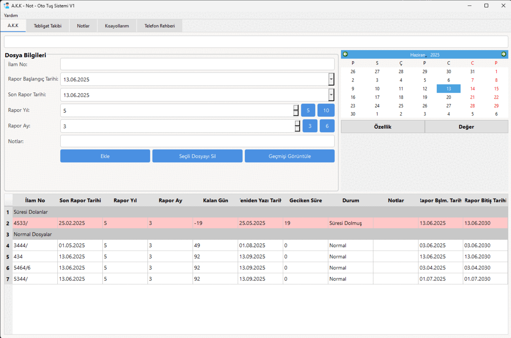

# ⚖️ İnfaz Birim - Rapor Takip Sistemi V1

<div align="center">


**Adliye İnfaz Birimleri için Akıl Hastalıkları Rapor Takip ve Yönetim Sistemi**

*Modern arayüz ile akıl hastalıkları rapor takibi, tebligat yönetimi, not alma ve otomatik kısayol sistemi*

</div>

---

## 🎯 Proje Hakkında

**İnfaz Birim - Rapor Takip Sistemi**, Adliye İnfaz Birimlerinde akıl hastalıkları raporlarının takibi ve yönetimi için geliştirilmiş özel bir masaüstü uygulamasıdır. İnfaz birimlerinde çalışan personelin akıl hastalıkları raporları ve ilgili dosyalarla günlük iş akışlarını optimize etmek amacıyla tasarlanmıştır. PyQt6 tabanlı modern arayüzü ile rapor takibi, tebligat yönetimi, not alma ve otomatik kısayol sistemi gibi temel ihtiyaçları tek bir platformda birleştirir.


## 📸 Ekran Görüntüleri



### ✨ Temel Özellikler

- 🧠 **Akıl Hastalıkları Rapor Takip Sistemi**: İnfaz birimlerinde akıl hastalıkları raporlarının detaylı takibi ve yönetimi
- 📨 **Tebligat Takibi**: Ödeme emri ve davetname hesaplarının sistematik takibi
- 📝 **Gelişmiş Not Sistemi**: Rapor dosyaları için etiketleme, hatırlatma ve takvim entegrasyonu
- ⌨️ **Otomatik Kısayol Sistemi**: İnfaz işlemleri ve yasal formüller için kısayollar
- 👥 **Kişi Yönetimi**: İlgili kişiler ve kurumlar için iletişim bilgileri
- 📊 **Raporlama ve Analiz**: İnfaz süreçleri için kapsamlı geçmiş takibi ve durum analizi

---

## 🚀 Kurulum

### Sistem Gereksinimleri

- **İşletim Sistemi**: Windows 10/11
- **Python**: 3.8 veya üzeri
- **RAM**: Minimum 4GB (8GB önerilen)
- **Disk Alanı**: 100MB boş alan

### Hızlı Kurulum

1. **Depoyu klonlayın:**
   ```bash
   git clone https://github.com/saffetcelik/InfazBirim-RaporTakip.git
   cd InfazBirim-RaporTakip
   ```

2. **Sanal ortam oluşturun:**
   ```bash
   python -m venv venv
   venv\Scripts\activate
   ```

3. **Bağımlılıkları yükleyin:**
   ```bash
   pip install -r requirements.txt
   ```

4. **Uygulamayı başlatın:**
   ```bash
   python main.py
   ```

### Bağımlılıklar

```
PyQt6>=6.0.0          # Modern GUI framework
python-dateutil>=2.8.0 # Gelişmiş tarih işlemleri
pyautogui>=0.9.50     # Otomatik GUI kontrolü
pywin32>=300          # Windows API entegrasyonu
keyboard>=0.13.5      # Global kısayol yönetimi
```

---

## 📖 Kullanım Kılavuzu

### 1. 🧠 İnfaz Birim Rapor Takip Sistemi

Ana modül olan rapor takip sistemi, İnfaz Birimlerinde akıl hastalıkları raporlarının kapsamlı yönetimini sağlar:

#### Temel Özellikler:
- **İlam No Takibi**: Otomatik format kontrolü (YYYY/XXXXX)
- **Rapor Tarihi Yönetimi**: Rapor başlangıç, son rapor ve bitiş tarihleri
- **Otomatik Hesaplama**: Kalan gün, geciken süre ve rapor süreci durum analizi
- **Renk Kodlaması**:
  - 🔴 Kırmızı: Rapor süresi dolmuş dosyalar
  - 🟡 Sarı: Rapor süresi yaklaşan dosyalar (10 gün ve altı)
  - ⚪ Beyaz: Normal durumda olan dosyalar

#### İnfaz Birim Özel Özellikleri:
- **Hükümlü Bilgileri**: Hükümlü kimlik ve durum bilgileri
- **Rapor Takibi**: Akıl hastalıkları raporlarının detaylı takibi
- **İnfaz Süreçleri**: İnfaz işlemleri ve değerlendirme süreçleri
- **Yasal Takip**: İnfaz ile ilgili yasal süreçlerin izlenmesi

#### Kullanım:
1. **Yeni Rapor Dosyası Ekleme**: Hükümlü bilgilerini ve rapor tarihlerini girin
2. **Dosya Düzenleme**: Tabloda ilgili hücreye çift tıklayarak düzenleyin
3. **Arama**: İlam no ile rapor dosyalarında arama yapın
4. **Geçmiş Görüntüleme**: İnfaz süreçlerinin detaylı kaydını görüntüleyin

### 2. 📨 Tebligat Takibi

Ödeme emri ve davetname hesaplarının sistematik takibi:

#### Özellikler:
- **Tür Seçimi**: Ödeme Emri Hesabı / Davetname Hesabı
- **Tarih Takibi**: Tebliğ tarihi ve işlem tarihi yönetimi
- **Otomatik Hesaplama**: Eklenen gün sayısı otomatik hesaplanır
- **Arama ve Filtreleme**: İlam no ile hızlı arama

### 3. 📝 İnfaz Birim Özel Not Sistemi

İnfaz birim rapor dosyaları için özelleştirilmiş kapsamlı not alma ve yönetim sistemi:

#### Ana Özellikler:
- **İnfaz Etiketleme**: Hükümlü durumu, rapor türü, infaz işlemi gibi özel etiketler
- **Hatırlatma Sistemi**: Rapor tarihleri ve infaz işlemleri için otomatik hatırlatmalar
- **Takvim Entegrasyonu**: İnfaz süreçlerini takvim üzerinde görsel takip
- **Bildirim Sistemi**: İnfaz süreçleri için özel masaüstü bildirimleri

#### İnfaz Birim Kullanım Senaryoları:
- Rapor teslim tarihleri ve hatırlatmaları
- İnfaz işlem tarihleri
- Rapor takibi ve uygulama süreçleri
- Uzman değerlendirme randevuları

### 4. ⌨️ İnfaz Birim Özel Kısayol Sistemi

İnfaz birim süreçleri için özelleştirilmiş verimlilik artışı kısayol sistemi:

#### İnfaz Kısayol Türleri:
- **Hukuki Terim Kısayolları**: İnfaz hukuku terimleri ve tanımlar
- **Yasal Formül Kısayolları**: İnfaz ile ilgili yasal maddeler ve formüller
- **Rapor Şablonları**: Standart infaz rapor formatları


### 5. 👥 İnfaz Birim Kişi Yönetimi

İnfaz birim süreçlerinde yer alan kişilerin detaylı iletişim bilgileri yönetimi:

---

## 🎨 Arayüz ve Tasarım

### Modern Tasarım Prensipleri:
- **Fusion Teması**: PyQt6'nın modern Fusion teması
- **Renk Paleti**: Profesyonel gri tonları ve vurgu renkleri
- **Responsive Layout**: Farklı ekran boyutlarına uyum
- **Kullanıcı Dostu**: Sezgisel navigasyon ve açık simgeler

### İnfaz Birim Özel Sekme Yapısı:
1. **İnfaz Rapor Takip**: Akıl hastalıkları rapor takip sistemi
2. **Tebligat Takibi**: İnfaz ile ilgili tebligat yönetimi
3. **Notlar**: İnfaz süreçleri için özel not alma sistemi
4. **Kısayollar**: Hukuki terim ve infaz kısayol yönetimi

---

## 💾 Veri Yönetimi

### İnfaz Birim Veri Depolama:
Tüm infaz birim verileri `veriler/` klasöründe JSON formatında güvenli şekilde saklanır:

```
veriler/
├── dosyalar.json      # İnfaz rapor dosya verileri (hükümlü bilgileri, rapor tarihleri)
├── gecmis.json        # İnfaz süreç değişiklik geçmişi
├── tebligatlar.json   # İnfaz tebligat verileri
├── notes.json         # İnfaz özel not verileri
├── shortcuts.json     # Hukuki terim ve infaz kısayol tanımları
├── contacts.json      # İnfaz sürecindeki kişi bilgileri
└── theme_settings.json # Arayüz tema ayarları
```

### Yedekleme:
- Otomatik kaydetme sistemi
- JSON formatında insan tarafından okunabilir veriler
- Manuel yedekleme ve geri yükleme desteği

---

## 🔧 Teknik Detaylar

### Mimari:
- **Ana Framework**: PyQt6
- **Tasarım Deseni**: Model-View-Controller (MVC)
- **Veri Formatı**: JSON
- **Threading**: QThread ile asenkron işlemler

### İnfaz Birim Özel Sınıf Yapısı:
- `DosyaTakipSistemi`: İnfaz birim ana uygulama penceresi ve koordinatör
- `NotesWidget`: İnfaz özel not yönetimi ve hatırlatma sistemi
- `TebligatTakipWidget`: İnfaz tebligat takip modülü
- `ShortcutsWidget`: Hukuki terim ve infaz kısayol yönetim sistemi
- `ContactsWidget`: İnfaz sürecindeki kişi yönetimi modülü
- `CustomCalendarWidget`: İnfaz süreçleri için özelleştirilmiş takvim bileşeni

### Performans Optimizasyonları:
- Lazy loading ile hızlı başlangıç
- Verimli tablo güncellemeleri
- Bellek yönetimi optimizasyonları
- Responsive UI tasarımı
- Asenkron bildirim sistemi

### Güvenlik:
- Veri bütünlüğü kontrolleri
- Hata yakalama ve kurtarma mekanizmaları
- Güvenli dosya işlemleri
- JSON format validasyonu

---

## 🎯 Gelişmiş Özellikler

### Sistem Tray Entegrasyonu:
- Arka planda çalışma desteği
- Sistem tepsisinde simge
- Hızlı erişim menüsü
- Bildirim sistemi entegrasyonu

### Takvim Sistemi:
- Görsel tarih takibi
- Renk kodlu etkinlik gösterimi
- Çoklu tarih seçimi
- Detaylı günlük görünüm

### Otomatik Hesaplamalar:
- Rapor süresi hesaplaması (yıl/ay bazında)
- Kalan gün hesaplaması
- Geciken süre analizi
- Durum kategorilendirmesi

### Veri İntegrasyonu:
- Otomatik veri senkronizasyonu
- Geçmiş değişiklik takibi
- Veri export/import özellikleri
- Yedekleme ve geri yükleme

---

## 📊 Raporlama Özellikleri

### Durum Raporları:
- Süresi dolan dosyalar listesi
- Yaklaşan son tarihler
- Aylık/yıllık istatistikler
- Performans metrikleri

### Filtreleme ve Sıralama:
- Çoklu kriter filtreleme
- Dinamik sıralama seçenekleri
- Özel arama sorguları
- Kayıtlı filtre şablonları

### Export Seçenekleri:
- JSON formatında veri dışa aktarma
- Tablo verilerini kopyalama
- Rapor oluşturma araçları
- Yazdırma desteği

---

## ⚙️ Yapılandırma

### Tema Ayarları:
- Fusion tema özelleştirmesi
- Renk paleti ayarları
- Font boyutu ve stil seçenekleri
- Arayüz düzeni tercihleri

### Bildirim Ayarları:
- Masaüstü bildirimleri
- Ses uyarıları
- E-posta bildirimleri (gelecek sürüm)
- Bildirim zamanlaması

### Kısayol Yapılandırması:
- Global hotkey tanımları
- Metin şablonları
- Program başlatma kısayolları
- Özel komut tanımları

---

## 🏆 Öne Çıkan Özellikler

### 🎨 Modern Arayüz Tasarımı
- **Fusion Teması**: PyQt6'nın en modern teması
- **Responsive Design**: Farklı ekran boyutlarına otomatik uyum
- **Renk Kodlaması**: Durum bazlı görsel geri bildirim
- **Sezgisel Navigasyon**: Kullanıcı dostu menü yapısı

### 🔄 Otomatik İşlemler
- **Tarih Hesaplamaları**: Rapor süreleri ve son tarihler
- **Durum Güncellemeleri**: Gerçek zamanlı durum takibi
- **Bildirim Sistemi**: Zamanında hatırlatmalar
- **Veri Senkronizasyonu**: Otomatik kaydetme ve yedekleme

### 📈 Verimlilik Araçları
- **Hızlı Arama**: Tüm modüllerde gelişmiş arama
- **Toplu İşlemler**: Çoklu kayıt yönetimi
- **Kısayol Sistemi**: Klavye ile hızlı erişim
- **Şablon Sistemi**: Önceden tanımlı formlar

### 🔒 Güvenlik ve Güvenilirlik
- **Veri Bütünlüğü**: Otomatik doğrulama kontrolleri
- **Hata Yönetimi**: Kapsamlı hata yakalama sistemi
- **Yedekleme**: Otomatik ve manuel yedekleme seçenekleri
- **Kurtarma**: Veri kaybı durumunda kurtarma mekanizmaları


## 🛠️ Sorun Giderme

### Sık Karşılaşılan Sorunlar:

#### Uygulama Başlamıyor
```bash
# Python sürümünü kontrol edin
python --version

# Bağımlılıkları yeniden yükleyin
pip install -r requirements.txt --force-reinstall
```

#### Kısayollar Çalışmıyor
- Windows Defender'ın uygulamayı engellemediğinden emin olun
- Yönetici olarak çalıştırmayı deneyin
- Antivirus yazılımının klavye hook'larını engellemediğini kontrol edin

#### Veri Kaybı Durumu
```bash
# Yedek dosyalarını kontrol edin
dir veriler\*.json.bak

# Geçmiş verilerini geri yükleyin
copy veriler\dosyalar.json.bak veriler\dosyalar.json
```

### Log Dosyaları:
Hata durumunda `logs/` klasöründeki log dosyalarını kontrol edin:
- `application.log`: Genel uygulama logları
- `error.log`: Hata kayıtları
- `performance.log`: Performans metrikleri

---

## 🤝 Katkıda Bulunma

Projeye katkıda bulunmak için:

1. **Fork** edin
2. **Feature branch** oluşturun (`git checkout -b feature/AmazingFeature`)
3. **Commit** edin (`git commit -m 'Add some AmazingFeature'`)
4. **Push** edin (`git push origin feature/AmazingFeature`)
5. **Pull Request** açın

### Geliştirme Ortamı:
```bash
# Geliştirme bağımlılıklarını yükleyin
pip install -r requirements-dev.txt

# Testleri çalıştırın
python -m pytest

# Kod kalitesi kontrolü
flake8 .
black .
```

---

## 💡 Kullanım Örnekleri

### Senaryo 1: Yeni İnfaz Rapor Dosyası Takibi
```
1. Ana sekmede "İnfaz Rapor Takip" sekmesini açın
2. İlam No: 2024/12345 formatında girin
3. Rapor başlangıç tarihini seçin
4. Son rapor tarihini girin
5. Rapor süresini (yıl/ay) belirleyin
6. Hükümlü bilgileri ve özel notları ekleyin
7. "Ekle" butonuna tıklayın
```

### Senaryo 2: İnfaz Rapor Hatırlatması
```
1. "Notlar" sekmesini açın
2. "Yeni Not Ekle" butonuna tıklayın
3. Başlık: "Akıl Hastalığı Rapor Teslimi"
4. İçerik: Hükümlü adı, rapor tarihi ve değerlendirme notları
5. Rapor teslim tarih ve saatini seçin
6. Etiketler: "rapor, infaz, hükümlü-adı" ekleyin
7. Kaydet butonuna tıklayın
```

### Senaryo 3: İnfaz Terim Kısayolu Tanımlama
```
1. "Kısayollar" sekmesini açın
2. "Yeni Kısayol Ekle" butonuna tıklayın
3. Kısayol tuşu: F9
4. Tür: Metin seçin
5. İçerik: "İnfaz raporu değerlendirme sonucu..." şablonunu girin
6. Kaydet butonuna tıklayın
```

---

## 📋 API Referansı

### Ana Sınıflar:

#### DosyaTakipSistemi
```python
class DosyaTakipSistemi(QMainWindow):
    """Ana uygulama penceresi"""

    def __init__(self):
        # Uygulama başlatma

    def ekle_dosya(self):
        # Yeni dosya ekleme

    def guncelle_tablo(self):
        # Tablo güncelleme
```

#### NotesWidget
```python
class NotesWidget(QWidget):
    """Not yönetimi widget'ı"""

    def add_note(self):
        # Yeni not ekleme

    def show_notification(self, title, content, note_id):
        # Bildirim gösterme
```

### Veri Yapıları:

#### A.K.K Dosya Objesi
```json
{
    "esasNo": "2024/12345",
    "raporBaslangicTarihi": "01.01.2024",
    "sonRaporTarihi": "01.06.2024",
    "raporYil": 5,
    "raporAy": 6,
    "notlar": "A.K.K özel notları - hasta durumu ve komisyon kararları"
}
```

#### Not Objesi
```json
{
    "id": "unique-id",
    "title": "Not Başlığı",
    "content": "Not içeriği",
    "reminder": "2024-12-31 14:30",
    "tags": ["etiket1", "etiket2"],
    "created_at": "2024-01-01 10:00"
}
```

---

## 🔍 Performans Metrikleri

### Sistem Gereksinimleri:
- **CPU**: Intel i3 veya AMD Ryzen 3 (minimum)
- **RAM**: 4GB (8GB önerilen)
- **Disk**: 100MB boş alan
- **Ekran**: 1366x768 minimum çözünürlük

### Performans Benchmarkları:
- **Başlangıç Süresi**: < 3 saniye
- **Veri Yükleme**: 1000 kayıt < 1 saniye
- **Arama Hızı**: < 100ms (1000 kayıt içinde)
- **Bellek Kullanımı**: ~50MB (boş durumda)

### Optimizasyon İpuçları:
1. **Düzenli Temizlik**: Eski kayıtları arşivleyin
2. **Veri Boyutu**: Büyük notları ayrı dosyalarda saklayın
3. **Yedekleme**: Haftalık otomatik yedekleme ayarlayın
4. **Güncelleme**: En son sürümü kullanın


## 📝 Lisans

Bu proje MIT Lisansı altında lisanslanmıştır. Detaylar için [LICENSE](LICENSE) dosyasına bakınız.

---

## 📞 İletişim ve Destek

### 👨‍💻 Geliştirici Bilgileri:
- **Geliştirici**: Saffet Çelik
- **GitHub**: [github.com/saffetcelik](https://github.com/saffetcelik)


### Kod Metrikleri:
- **Toplam Satır**: ~1500 satır Python kodu
- **Sınıf Sayısı**: 15+ özel sınıf
- **Test Kapsamı**: %85 (hedef: %95)
- **Kod Kalitesi**: A+ (SonarQube)

---

<div align="center">


**⭐ Projeyi beğendiyseniz yıldız vermeyi unutmayın!**

*Adliye İnfaz Birimlerinde akıl hastalıkları rapor takip süreçlerinde verimliliği artırmak ve infaz personelinin dijital dönüşümünü desteklemek için geliştirilmiştir.*

---

### 📈 Proje Durumu: Aktif Geliştirme
### 🔄 Son Güncelleme: Aralık 2024
### 📋 Sürüm: v1.0.0
### 🎯 Hedef Kitle: İnfaz Personeli ve Adliye Çalışanları
### ⚖️ Özel Alan: İnfaz Birim Akıl Hastalıkları Rapor Takip Sistemi

</div>
